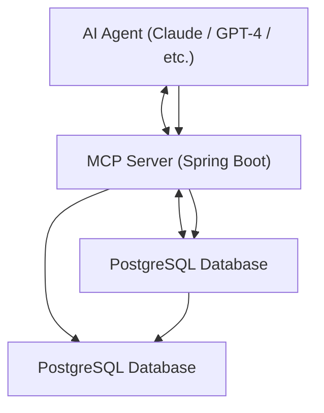

# 📝 Task Manager MCP Server

## 📖 Overview
The **Task Manager MCP Server** is a Spring Boot application that exposes a **Model Context Protocol (MCP)** interface.  
It enables AI agents like **Claude**, **GPT-4**, etc., to interact with a shared **PostgreSQL Task Management Database**.

Key features:
- Schema inspection (`/mcp/schema/tasks`)
- Bulk task insertion (`/mcp/tasks`)
- Summary analytics (`/mcp/tasks/summary`)
- Agent-readable help (`/mcp/help`)

---

## 🧩 Architecture

### Mermaid Diagram (GitHub-ready)


### Diagram Explanation
- **AI Agent**: The AI agent that interacts with the MCP server.
- **MCP Server**: The Spring Boot application that exposes the MCP interface.
- **PostgreSQL Database**: The shared database where tasks are stored.
er connects to the PostgreSQL database.
---
## Technology Stack
- **Spring Boot 3.2**: The backend framework for building the MCP server.
- **PostgreSQL**: The database used for storing tasks.
- **MCP**: The Model Context Protocol used for communication between the AI agent and the MCP server.
- **Java 17+**: The programming language used for the backend code.
- **Spring Data JPA**: The ORM (Object-Relational Mapping) library used for database interactions.
- **Springdoc OpenAPI/Swagger**: The documentation framework used for generating API documentation.
---
## 🚀 How to Run 
### Clone the repository: 
- git clone https://github.com/your-org/taskmanager-mcp-server.git
- cd taskmanager-mcp-server
- Update application.properties (or application.yml) with your local DB:
```properties
spring.datasource.url=jdbc:postgresql://localhost:5432/taskdb
spring.datasource.username=task_user
spring.datasource.password=task_pass
spring.jpa.hibernate.ddl-auto=update
```
### Run the application:
- mvn spring-boot:run
- The server starts at:
  👉 http://localhost:8080

### Swagger UI (interactive API docs):
👉 http://localhost:8080/swagger-ui/index.html

---
## 🧠 AI Agent (Claude) Integration
- Claude (or another MCP-enabled AI agent) connects via a config file.
- Example claude_desktop_config.json:
 ``` 
{
  "mcpServers": {
    "task-manager": {
      "command": "node",
      "args": [
        "C:\\Users\\your-username\\IdeaProjects\\mcp\\mcp\\mcp-proxy.js"
      ]
    }
  }
}

 ```
### Notes for other machines:

- Replace _**C:\\Users\\your-username\\IdeaProjects\\mcp\\mcp\\mcp-proxy.js**_ 
  with the absolute path to your mcp-proxy.js.
- On Linux/Mac, the path might look like:
```
"/home/username/projects/mcp/mcp-proxy.js"
```
- Make sure the path is correct and accessible by the AI agent.
## 💬 Example Prompt to Claude
```
Please inspect the task schema at /mcp/schema/tasks.  
Then generate and insert 1000 diverse tasks with random statuses, titles, and due dates using the /mcp/tasks endpoint.  
Finally, verify insertion using /mcp/tasks/summary.
```
### ✅ Expected Results
* /mcp/schema/tasks → Returns schema of Task
* /mcp/tasks → Inserts ~1000 tasks
* /mcp/tasks/summary → Returns analytics:
````
{
  "totalTasks": 1000,
  "statusDistribution": {
    "TODO": 250,
    "IN_PROGRESS": 200,
    "DONE": 350,
    "CANCELLED": 100,
    "ON_HOLD": 100
  },
  "priorityDistribution": {
    "LOW": 200,
    "MEDIUM": 400,
    "HIGH": 300,
    "URGENT": 100
  }
}
````
---
## 📚 Deliverables

✅ Source code (Spring Boot + MCP server)

✅ PostgreSQL config

✅ README.md (this file)

✅ Example Claude prompts + results

✅ Swagger UI (interactive API docs)
